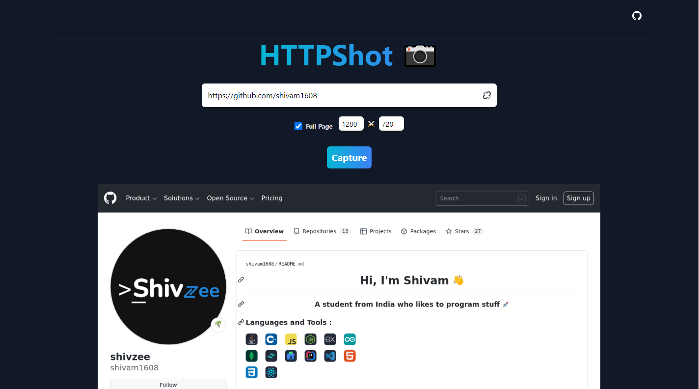

# HTTPShot 📷
A simple web screenshot API written in Go provied with basic web client.


### Live On 🟢
[https://httpshot.tk/](https://httpshot.tk/)

## API Documentation 📘
- Yea its live on web means you can use it too if you want to with its easy one simple Api Endpoint

**GET** ` https://httpshot.tk/api/capture `
#### OPTIONS ⚙
<table>
<thead>
  <tr>
    <th>Query</th>
    <th>Required?</th>
    <th>Description</th>
  </tr>
</thead>
<tbody>
  <tr>
    <td>url</td>
    <td>REQUIRED</td>
    <td>Url of the webpage to capture</td>
  </tr>
  <tr>
    <td>width</td>
    <td>OPTIONAL</td>
    <td>The width of viewport</td>
  </tr>
  <tr>
    <td>height</td>
    <td>OPTIONAL</td>
    <td>The height of viewport</td>
  </tr>
  <tr>
    <td>fullscreen</td>
    <td>OPTIONAL</td>
    <td>Scrolls and capture full webpage</td>
  </tr>
</tbody>
</table>

### Example 
```curl 
CURL -XGET 'https://httpshot.tk/api/capture?url=https://github.com/&width=1280&height=720&fullscreen=false'
```

## Preview


## Open Source Project 
Author : Shivzee
<br />
IDE Used : Visual Studio Code
